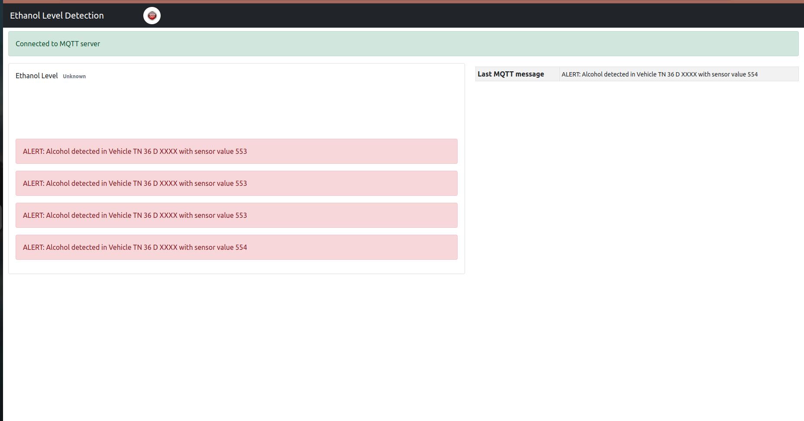

# HTML Documentation

## Introduction

This document provides documentation for the HTML project.

## Installation

VScode can be installed on your Linux system via the Snap Store:

[VScode on Snap Store](https://snapcraft.io/search?q=vscode+)

Alternatively, you can download it from the official website:

[Official VScode Website](https://code.visualstudio.com/download)

Linux also offers text editors supporting various languages like HTML, JavaScript, CSS, etc. In the text editor, at the bottom right corner, you can find `"plain text"`  clicking it allows you to switch to your desired language.

Configure VScode according to your requirements. To open a file, create a folder to save your projects, and then open the folder using:

```
ctrl+k ctrl+o

Or

file -> open folder
```
Your project folder is now ready to use.

## Firebase Database 

Firebase, developed by Google, is a platform offering a suite of tools and services for building web and mobile applications.

Firebase provides a NoSQL cloud-hosted database for storing and syncing data in real-time across multiple clients, ideal for applications needing real-time updates like chat applications and collaborative tools.
 
The Firebase database was utilized to store user authentication information, which is essential for user login and registration.

Firebase Authentication provides user-friendly authentication services, including email/password authentication, social login (using providers like Google, Facebook, and Twitter), phone number authentication, etc., enabling developers to securely authenticate users and manage user identities in their applications.

[Firebase console](https://console.firebase.google.com/)

For detailed instructions on creating Authentication, refer to:

[Authentication Setup Video](https://youtu.be/FjXzJ2wVs5g?si=wv_HLeLz6rpWbVVt)


## Home.html 

This file contains both HTML and JavaScript code integrated into one. The Firebase database is used for authentication, allowing authorized users to log in and access the dashboard.

#### Firebase Configuration in JavaScript:

Just copy the code from the Firebase by using the following step:
```
Project overview -> General -> CDN
```
You can find the configuration specific to your project there.

```
const firebaseConfig = {
            apiKey: "API_key",
            authDomain: "AUTH",
            projectId: "Project_ID",
            storageBucket: "Storage_Bucket",
            messagingSenderId: "Sender_ID",
            appId: "APP_ID"
        };
```
Customize the code as per your requirements. This configuration file is also used in register.html.

## Dashboard.html 

The JavaScript code includes a connect function to establish a connection with the Mosquitto MQTT over WebSockets.

```
let mqttClient;
        let mqttTopic = "TOPIC_NAME";
        let alertCount = 0;

        function MQTTconnect() {
            mqttClient = new Paho.MQTT.Client("HOST", 9001, "clientId" + new Date().getTime());
            mqttClient.onMessageArrived = onMessageArrived;
            mqttClient.connect({ onSuccess: onConnect });
```

This function is used to connect to the MQTT broker over WebSockets.
To configure the Mosquitto MQTT, change the MQTT config file: 

#### Access Terminal:

```
sudo nano /etc/mosquitto/mosquitto.conf
```
Here is a sample MQTT config file used to connect MQTT over WebSockets.

```
# Place your local configuration in /etc/mosquitto/conf.d/
#
# A full description of the configuration file is at
# /usr/share/doc/mosquitto/examples/mosquitto.conf.example

persistence true
persistence_location /var/lib/mosquitto/

log_dest file /var/log/mosquitto/mosquitto.log

include_dir /etc/mosquitto/conf.d


listener 1883
protocol mqtt
allow_anonymous true

listener 9001
protocol websockets
allow_anonymous true
```
## Dependencies

* [paho-mqtt](https://eclipse.dev/paho/index.php?page=clients/python/index.php/)
 
* [mqtt](https://github.com/mqttjs/MQTT.js)

## MQTT broker/server

An MQTT broker/server with WebSocket support is required.

* [Mosquitto:](https://mosquitto.org/) An Open Source MQTT v3.1/3.11 broker

# Dashboard panel



